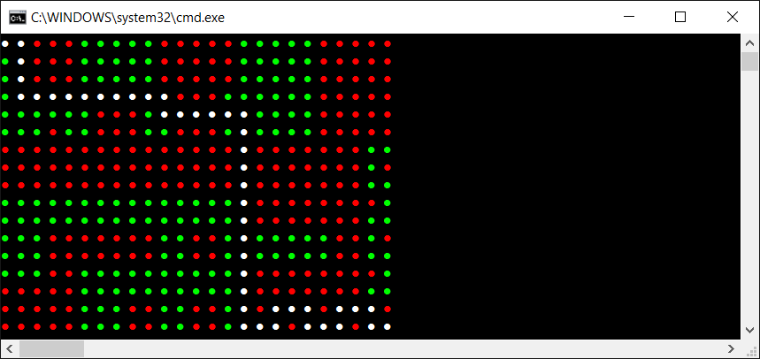

# Najkrótsza trasa na mapie gry

Znaleźć (narysować) najkrótszą ścieżkę z lewego górnego narożnika do prawego dolnego narożnika na mapie gry zadanej jako tablica string'ów.

Znakami `#` oznaczono przeszkody.

```csharp
string[] lines = new string[] 
{ 
    "..###.....#####.....#####", 
    "..###.....#####.....#####", 
    "..###.....#####.....#####", 
    "...........###......#####", 
    "......###...........#####", 
    "...#..###..###......#####", 
    "###############.#######..", 
    "###############.#######.#", 
    "###############.#######..", 
    "................########.", 
    "................#######..", 
    "...#######..##.......##.#", 
    "...#######..##.......##..", 
    "...##...........########.", 
    "#####...........#######..", 
    "#####...##..##..#...#...#", 
    "#####...##..##....#...#.." 
};
```

Przykładowe rozwiązanie


## Inne zadania podobnego typu

* SPOJ Challenge: <https://www.spoj.com/problems/LAWN/>
* SPOJ Classical: <https://www.spoj.com/problems/LABYR1/>
* SPOJ Classical: <https://www.spoj.com/problems/PT07Z/>
* SPOJ Classical z kategorii `depth-first search`: <https://www.spoj.com/problems/tag/dfs>
* SPOJ Classical z kategorii `breadth-first search`: <https://www.spoj.com/problems/tag/bfs>

